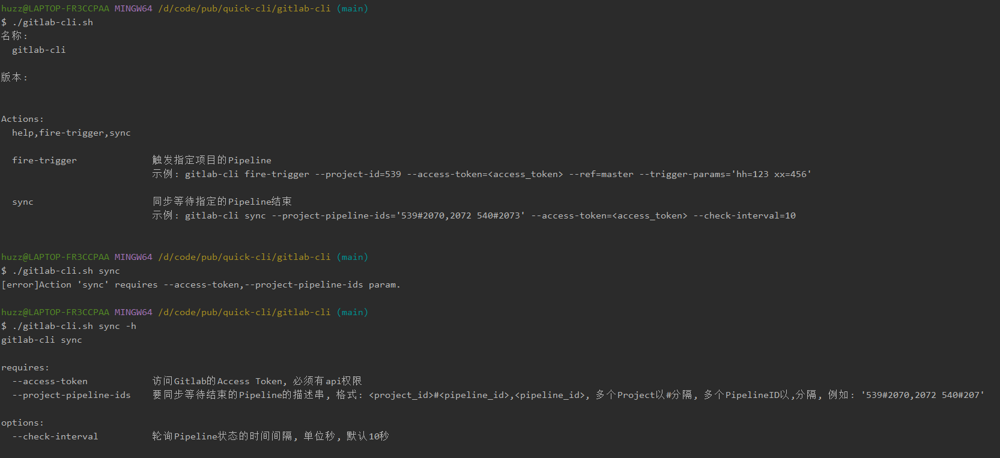

# quick-cli
快速创建shell脚本的脚手架工具，gitlab-cli示例如下:

## 背景
通常我们写的shell是以参数的方式传递变量的, 例如:
```shell
./query.sh "alibaba" "$name" "2021"
```
一旦变量`name`是空值, 很容易导致参数错位, 因为我们在写shell的时候, 一般都是通过位置变量获取外部输入参数的, 例如:
```shell
#!/bin/bash
readonly company="$1"
# 如果在传参的时候, name是空的, 则year的值会被赋值给name, 参数就错位了, 显然我们不想让这种事情发生
readonly name="$2"
readonly year="$3"
```
我们可以加入一些逻辑判断语句来解决这个问题, 例如:
```shell
#!/bin/bash
readonly company="$1"
readonly name="$2"
if [ -z "$name" ]; then
  # 如果name为空, year取第二个参数
  year="$2"
else  
  # 如果name不为空, year取第三个参数
  year="$3"
fi
```
这种方法在参数较少的时候可以用一下, 一旦参数多起来后, 条件判断复杂, 很容易出错, 且这种shell对参数传递的顺序要求很高, 易用性不高.
另外还有一些其他的缺点:
- 需要手动写help帮助文档的逻辑
- 需要手动写控制可选参数和必选参数的逻辑
- 需要手动写参数格式校验的逻辑

利用quick-cli.sh, 我们可以快速创建一个cli工具, 快速生成一个具有输出help文档、参数控制和校验功能的shell脚本.
# 快速开始
## 安装yq
[yq](https://mikefarah.gitbook.io/yq/) 是用来处理yaml文件的命令, 特别好用, 提高了shell处理复杂的数据结构的能力.

yq安装方法(更多安装方法详见[官网](https://mikefarah.gitbook.io/yq/)):

Homebrew
```shell
snap install yq
```
Snap
```shell
brew install yq
```
## 安装jq
[jq](https://stedolan.github.io/jq/) 是用来处理json文件的命令, 同样提高了shell处理复杂的数据结构的能力.

jq安装方法(二进制下载安装详见[官网](https://stedolan.github.io/jq/)):
```shell
sudo apt install jq
```
## 准备cli文件夹
拷贝任意一个已有的cli, 这里以lark-cli(发送飞书消息的工具)作为示例: 

在项目根目录执行:
```shell
cp -r lark-cli my-cli
```

新的cli名称为: `my-cli`, 根据自己的需求修改`my-cli`目录的子目录下的文件内容.

## 构建
在项目根目录运行以下命令, 就可以在`my-cli`目录下生成`my-cli.sh`文件.
```shell
./quick-cli create --tool-name="my-cli"
```
# 文件和目录说明
## adam.sh
最原始的shell, 用来构建quick-cli.sh(eat your own dog food)

## quick-cli.sh
使用create命令创建脚手架, --tool-name选项指定脚手架的名称(与quick-cli.sh同级的目录名称), --tool-version选项指定脚手架的版本. 示例如下:
```shell
./quick-cli.sh create --tool-name="lark-cli" --tool-version="v1.0.0"
```

## 脚手架目录规范
要创建一个shell脚本, 需要创建一个对应的目录, 目录以shell脚本名称命名. 其目录下具有以下子目录:
### actions
用于存放具体的action脚本文件以及action描述文件
#### action脚本
- 文件格式: `*.sh`
- 文件内容: 一个具体的action方法(shell语法格式), 方法名称要与action的名称一一对应(方法名称使用`_`代替`-`), 可以使用variables中定义的变量以及functions中定义的方法.
#### action描述文件
- 文件格式: `*.yaml`
- 文件内容: 定义action的描述、对应的shell脚本、使用示例、选项

yaml各个字段的详细解释和示例如下:
```yaml
## [非必须]Action的脚本文件, 默认取值的计算方式如下:
## 假设Action文件名为: send-msg.yaml, 则默认值为send-msg.sh
## 注意: 配置是非必须的, 但文件必须存在
file: send-msg.sh

## [非必须]Action的描述信息, 用于生成help
description: 发送消息

## [非必须]Action的使用示例, 用于生成help
use_example: lark-cli send-msg --app-id=x123 --app-secret

## [非必须]Action的可选项
options: [ remove ]

## [非必须]Action的必选项
required: [ app-id, app-secret ]
```
### functions
用于存放自定义的函数(非action), 文件格式为`*.sh`, 内容采用标准的shell语法编写, 在function中可以使用variables中定义的变量.

所有的function都会被拷贝到生成的shell文件中.
### options
用于存放脚本的选项(option).

- 文件格式: `*.yaml`
- 文件内容: 定义选项的类型、选项的描述、长选项名称、短选项以及接收选项值的变量名称.

yaml各个字段的详细解释和示例如下:
```yaml
## [非必须]选项的描述, 用于生成help文档
description: 应用的appID

## [非必须]选项的类型,取值范围: flag,value,value_opt, 默认值为value
# flag: 不能指定参数值, 一般用于boolean变量, 常用于开关, 例如"--quiet"
# value: 用于指定参数值, 且必须指定一个参数值, 例如"--app-id=x1234"
# value_opt: 用于指定参数, 但可以不用指定参数值, 当不指定参数值的时候, 取default字段指定的默认值
type: value

## [非必须]参数的默认值, 当没有指定该字段的时候, 对于type取不同值的时候, default字段的默认值有所不同, 规则如下:
# type=flag: default字段默认值为false
# type=value: default字段默认值为""
# type=value_opt: default字段默认值为""
default: x1234

## [非必须]长选项, 默认取值的计算方式如下:
# 假设选项定义文件名为: tool-name.yaml, 则默认值为app-id
long: app-id

## [非必须]短选项
short: a

## [非必须]选项对应的变量值, 在脚本中可以使用这个变量
var_name: app_id
```

### variables
用于定义全局变量, 文件格式为`*.sh`, 内容采用标准的shell语法编写. 所有的variable都会被拷贝到生成的shell文件中.
